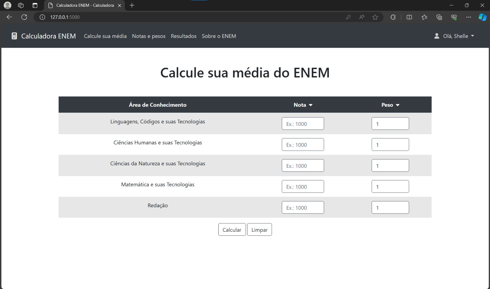

<!-- Include calculator icon from https://fontawesome.com/ -->
<link href="https://cdnjs.cloudflare.com/ajax/libs/font-awesome/6.2.1/css/all.min.css" rel="stylesheet">

# <i class="fa-solid fa-calculator" style="margin-right: 5"></i> Calculadora ENEM (ENEM Calculator)

|
|:--:| 
***Figura 1:** Tela inicial do programa para um usuário cadastrado*|

## 📽️ Video Demo
<https://youtu.be/0IVnKBge6-U>

## 📋 Description
**Calculadora ENEM** is a web application via which you can calculate the simple and weighted average of your ENEM scores. You can also save your scores, weights of each subject, and results if you create an account. At first, it was designed for my and my sister's personal use, and _it helped us a lot_!  

IIn case you don't know, ENEM (High School National Exam) is Brazil's most important college entrance exam. It lets students from all over the country apply to almost all public universities in Brazil, get scholarships from private universities, and even get a student loan.

You can find more information on [ENEM's official website](https://www.gov.br/inep/pt-br/areas-de-atuacao/avaliacao-e-exames-educacionais/enem).

## 💡 Calculadora ENEM's Main Features

Calculadora ENEM **solves a common bother** that students come across during this delicate time of their life, which is having to calculate _over and over again_ their final scores for multiple university courses, and having to either type the same scores _again and again_, or write down manually their scores and results _all the time_. It lets you:

😄 Calculate your ENEM simple and weighted avererage. 

🤓 Save your scores for multiple ENEM's. 

😎 Save different weights for multiple courses. 

😲 Use your saved scores, weights and results again on the calculator with a button click! 

The main goal is to help students **optimize** this process and **focus on what really matters** while planning and wondering which course they're going to apply to.

## 📁 Project Files and Folders 
### 1. `app.py`
It contains the **backend of the web application**, handling most of the data validations in each route, database queries and modifications, generation of the web application's pages' contents, etc. 

- `Flask` is used to render templates, flash warnings, access forms' data, store cookies, etc. 
- `Werkzeug security` is used to store and check passwords safely. 
- `CS50 library` is used to connect to the `SQLite` database. 

This file handles most of the web application logic.

### 2. `helpers.py`
It contains a function to make **login required** on certain pages, not letting non-registered users access features that require an account.

### 3. `calculadora.db`
It is the **web application's database**, in which information such as a user's saved scores, results, and weights, in addition to all the registered users and respective encrypted passwords, is stored.

### 4. `static/`
This folder contains all the **static files** of the program, that is, all the `CSS` and `JavaScript` code.

### 4.1. `static/adicionar.js`
This script **validates the form data** when saving a new score or weight. It prevents the form from submitting if there are blanch fields or invalid values.

### 4.2. `static/module.mjs`
This script **export** to the other two scripts **variables to be used**, such as an array of all ENEM subjects, and two validation functions, one to validate the submitted scores and the other to validate the submitted weights.

### 4.3. `static/script.js` 
This script **calculates the simple and weighted average** of the scores submitted via the homepage form.
- It **shows the results** on the page for the user;
- It **allows the user to save their results** by clicking on the save button, passing the calculator form data to the saving results form;
- When the **clear button** is clicked, it clears all the form data, refreshing the page (more specifically, redirecting to the same page).

### 4.4. `static/styles.css`
It contains a little of the **stylization** of the page, since Bootstrap is also used.

### 5. `templates/`
All the **templates** for generating the `HTML` pages are stored here.

### 5.1. `templates/adicionar.html`
It's the **template** of the web application pages for **saving or modifying a user's scores or weights**. It generates a different page depending on which one of those two the user selected.

### 5.2. `templates/cadastro.html`
It consists of the **registration page** and has a link to the login page.

### 5.3. `templates/index.html`
This template represents the **homepage**, where you can **calculate the simple and weighted average and, if logged in, save your results**. It has a link to the registration page and another to the login page if the user is not logged in.

### 5.4. `templates/layout.html`
This template consists of the _layout of all the other templates_. 
- It has the `HTML` basic structure, in addition to including `Bootstrap`, `Font Awesome`, and `static/styles.css` in all templates. 
- It makes the **navigation bar** and the `Flask flashing messages` available in all templates. 

It's the **basic structure of all templates**.

### 5.5 `templates/login.html`
It consists of the **login page** and has a link to the register page, along with an "I forgot my password" link, which redirects the user to a page where they can change their password.

### 5.6. `templates/notas-e-pesos.html`
This file represents the **page where the user can see, add, modify, and delete their scores and weights**. It also _allows them to use their saved scores and weights on the ENEM Calculator just by clicking on a button, without having to type them manually each time_ .

### 5.7. `templates/nova-senha.html`
It is the page where the user can **change their password**. If the user isn't logged in, it has a username input field. Otherwise, it uses the username stored in the session instead.

### 5.8. `templates/resultados.html`
It is the page where the user can **see and delete their results**. It has a link to the homepage, where the user can add more results. It also _allows the user to use their saved results on the ENEM Calculator by clicking on a button, without having to type it manually_.

### 5.9. `templates/sobre.html`
This file is a page with **information about ENEM**, such as what is is, where you can see your scores, how you can use them to enter a university, etc. It also _has links to official pages_, where you can find more information about it.